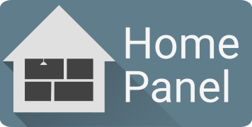

# Home Panel

A web frontend for controlling the home. Integrates with [Home Assistant](https://www.home-assistant.io) as an additional frontend.

## Features

- Supports [Home Assistant](https://www.home-assistant.io) entities, cameras, news feeds, iframes and more.
- Fully customizable interface.
- Custom theme support.
- Full in-application configuration UI.

## Documentation / Setup

Setup and configuration for the app is available [here](https://home-panel.timmo.dev/docs/setup)

## Links

[Discussions / Support](https://github.com/timmo001/home-panel/discussions)

[Code of Conduct](.github/CODE_OF_CONDUCT.md)

[License](LICENSE)
